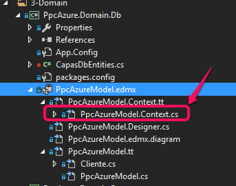
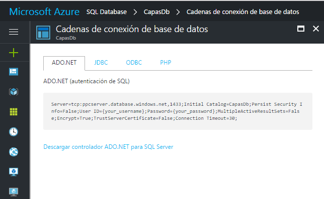
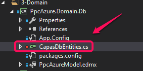
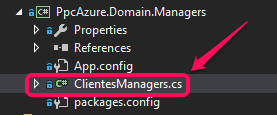

# PROGRAMACION POR CAPAS EN AZURE
## COMENTAR CODIGO
Se debe en primer lugar comentar el código del método OnModelCreating del [DbContext](https://github.com/Nestornjrz/ProgXcapas/blob/master/PpcAzure/PpcAzure.Domain.Db/PpcAzureModel.Context.cs) para evitar que se
ejecute la excepción




``` csharp

namespace PpcAzure.Domain.Db
{
    using System.Data.Entity;

    public partial class CapasDbEntities : DbContext
    {
        public CapasDbEntities()
            : base("name=CapasDbEntities")
        {
        }

        protected override void OnModelCreating(DbModelBuilder modelBuilder)
        {
            //throw new UnintentionalCodeFirstException(); <== Comentado
        }

        public virtual DbSet<Cliente> Clientes { get; set; }
    }
}
```

Hay que tener en cuenta también que este código se regenerara la próxima vez que lo actualicemos
así que debemos comentar de nuevo.


## ConnectionString

Aunque el asistente para realizar el [Database Firts](https://msdn.microsoft.com/en-us/library/jj206878%28v=vs.113%29.aspx?f=255&MSPPError=-2147217396)
ya crea la cadena de conexión en el archivo [App.Config](https://github.com/Nestornjrz/ProgXcapas/blob/master/PpcAzure/PpcAzure.Domain.Db/App.Config) ...


``` xml

  <connectionStrings>    
  <add name="CapasDbEntities" 
       connectionString="metadata=res://*/PpcAzureModel.csdl|res://*/PpcAzureModel.ssdl|res://*/PpcAzureModel.msl;provider=System.Data.SqlClient;provider connection string=&quot;data source=ppcserver.database.windows.net;initial catalog=CapasDb;persist security info=True;user id=Nestor;password=xxxxxxx;MultipleActiveResultSets=True;App=EntityFramework&quot;" 
       providerName="System.Data.EntityClient" />
  </connectionStrings>
```

... en el Web.Config de la WEB API debemos colocar el **ConnectionString** la cadena de coneccion que
nos provee azure



# OBSERVACION

En el Web.config de la WebApi no aparece aqui la cadena de conexión precisamente para no exponer la contraseña. La manera en como se oculta aquí del control de código la contraseña es crear un partial class



``` csharp

namespace PpcAzure.Domain.Db
{
    public partial class CapasDbEntities : DbContext
    {
        /// <summary>
        /// Esta clase es solo para no enviar la contraseña del connectionString para github
        /// </summary>
        /// <param name="connectionString">En realidad lo que llegue aqui no modifica nada</param>
        /// <param name="paraLaFirma">Lo que llega aqui no modifica nada</param>
        public CapasDbEntities(string connectionString, bool paraLaFirma)
            : base("Server=tcp:ppcserver.database.windows.net,1433;Initial Catalog=CapasDb;Persist Security Info=False;User ID=Nestor;Password=xxxxxx//;MultipleActiveResultSets=False;Encrypt=True;TrustServerCertificate=False;Connection Timeout=30;")
        {

        }
    }

}

```

Lo que sucede es que al instanciar el DbContext debemos utilizar esta sobrecarga del constructor en
los managers...



... por ejemplo en el archivo ClientesManagers al instanciar CapasDbEntities

``` csharp
new CapasDbEntities("LoqueSea", true)
```

El ejemplo completo

``` csharp

namespace PpcAzure.Domain.Managers
{
    public class ClientesManagers
    {
        public static async Task<List<ClienteDto>> GetAllList()
        {
            using (var context = new CapasDbEntities("LoqueSea", true))
            {
                var listado = await context.Clientes.Select(s => new ClienteDto()
                {
                    ClienteID = s.ClienteID,
                    Nombre = s.Nombre,
                    Apellido = s.Apellido
                }).ToListAsync();
                return listado;
            }
        }
    }
}

```

