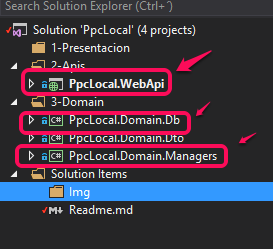

# PROGRAMACION POR CAPAS

## TECNOLOGIA UTILIZADA

* .NET Framework 4.6.1
* Asp.Net 
* ~~Angular 2 (Esta por salir [Angular 4](https://github.com/angular/angular/blob/master/CHANGELOG.md#400-beta5-2017-01-25) , asi que lo voy a pasar a eso cuando este estable)~~
* Web Api 2
  * [Swegger](http://swagger.io/) para facilitar ver las APIs de una manera mas "amigable"
* SqlServer 

## CONSTA DE 3 CAPAS
* **Presentacion**
  * Aqui estan las aplicaciones que el usuario vera, la parte visual de la aplicacion, aqui se utilizara ANGULAR 2 + MVC5
* **Apis** (Application Programming Interface)
  * Esta es la parta donde se encuentra los servicios web (API REST)
* **Domain**
  * Aqui estan los DTO
  * Aqui estan la logica de la aplicacion y el acceso a datos por medio de ENTITYFRAMEWORK 6.X

# PROBLEMA

Pasa que en esta aproximacion, se tiene que instalar el paquete EntityFramework tanto en el proyecto
**PpcLocal.Domain.Db, PpcLoca.Domain.Db y Ppc.Domain.Managers** cuando deveria estar solo en **PpcLocal.Domain.Db**

